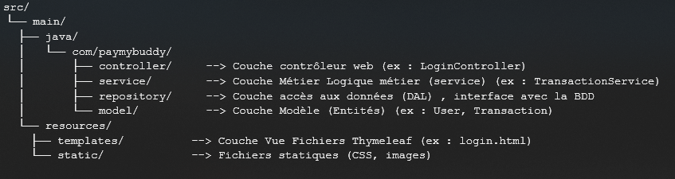
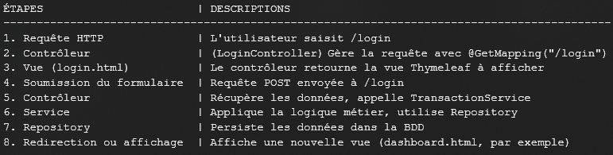
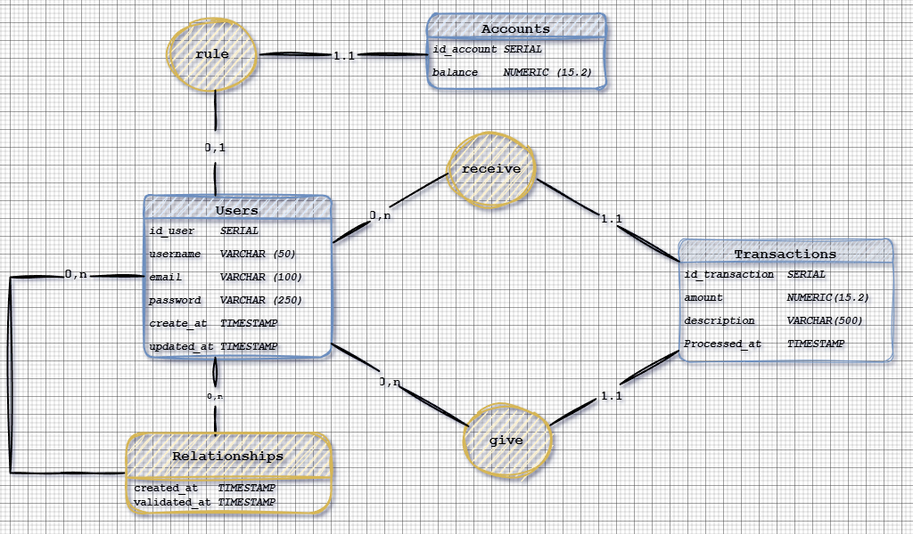
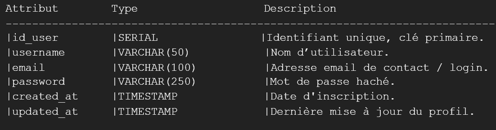
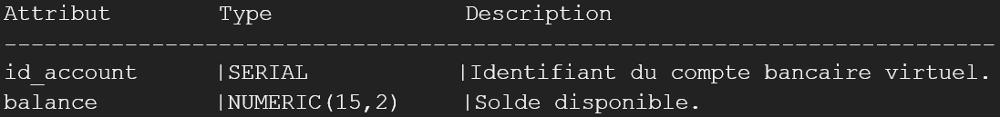
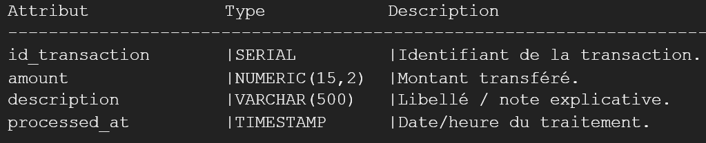
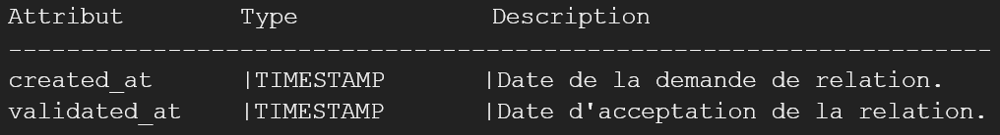
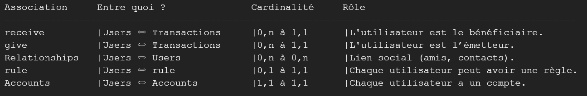
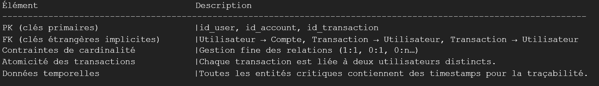
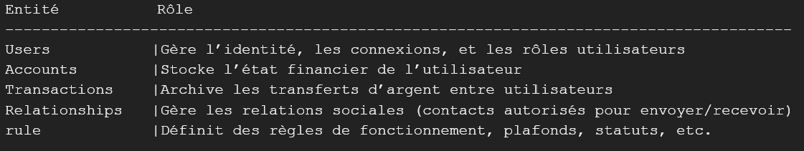

### PROJET PÉDAGOGIQUE OpenClassrooms SUR LE THÈME : CONCEVOIR UNE APPLICATION WEB EN Java DE À Z.
 


* PayMyBuddy est une plateforme web permettant aux utilisateurs de gérer leurs contacts et de réaliser des transactions entre amis.`


### FONCTIONNALITÉS

- Inscription et authentification des utilisateurs
- Gestion des relations utilisateur (ajout, validation, suppression)
- Transactions de paiement entre utilisateurs
- Modification des informations de l'utilisateur


### TECHNOLOGIES UTILISÉES

- **Java 21** - Langage de programmation.
- **Spring Boot 3.3.1** - Framework Java pour créer des applications web.
- **PostgreSQL** - Systeme de gestion de base de données relationnelle.
- **Gradle** - Outil de build automatisé.
- **Thymeleaf** - Moteur de template pour la génération de pages HTML.
- **Tailwind CSS** - Framework CSS pour la conception de l'interface utilisateur.

### Architecture de l'application Patern MVC
L'application suit le modèle MVC (Model - View - Controller) avec la structure suivante :



#### Le but du MVC :
* Le pattern MVC (Model-View-Controller) vise à séparer les responsabilités :
* Model : Données + logique métier
* View : Présentation pour l’utilisateur
* Controller : Intermédiaire, gère les requêtes et orchestre le tout

#### Spring Boot relie le tout :



#### En utilisant cette structure MVC dans Spring Boot :
* Code organisé	: Chaque fichier a une responsabilité claire
* Facilité de maintenance : Modifications localisées (ex : changer la vue n’impacte pas le modèle)
* Testabilité : Les services et les contrôleurs sont facilement testables (unitaires et intégration)
* Respect des bonnes pratiques : Architecture propre, découplée, modulaire


### Modèle Physique de Données :



#### Voici une analyse exhaustive et détaillée, structurée en 5 parties : 
* Entités
* Attributs
* Relations
* Contraintes

#### 1. Entités principales

####   Users (utilisateurs)



#### Accounts (comptes utilisateurs)




Chaque utilisateur dispose d’un seul compte, et chaque compte est lié à une règle métier.

##### Transactions (opérations financières)



Chaque transaction est émise par un utilisateur (give) et reçue par un autre (receive).

##### Relationships (relations amicales)



* Relation symétrique entre deux utilisateurs. 
* Elle contient deux colonnes de type id_user_1 et id_user_2 (non visibles ici).

+ rule (règles métier)
+ Elle contient des limites (ex : plafond journalier, KYC, statut de vérification).

Chaque utilisateur peut avoir 0 ou 1 règle, et chaque règle est assignée à un compte unique.

#### 2. Relations (associations)



#### Relations :

* Associé à un compte (Accounts)
* Peut donner ou recevoir des transactions
* Peut avoir une règle (rule)
* Peut être engagé dans plusieurs relations (Relationships)

#### 3. Contraintes d’intégrité




#### 4. Synthèse fonctionnelle




## MISE EN PLACE


1. CLONEZ LE REPOSITORY :
    ```sh
    git clone https://github.com/micjazer/Pay-My-Buddy.git
    ```


2. CRÉER UNE BASE DE DONNÉES PostgreSQL `pay_my_buddy` 
& Y INSÉRER DANS L'ORDRE CI DESSOUS LES SCRIPT SQL CONTENUS DANS LE DOSSIER : `src/main/resources` :
   - `bdd.sql` - Création des tables
   - `data.sql` - Insertion des données
   - `triggers.sql` - Création des triggers


3. CONFIGUREZ LA BASE DE DONNÉES DANS `src/main/resources/application.properties` :²
    ```properties
    spring.datasource.url=jdbc:postgresql://localhost:5432/pay_my_buddy?currentSchema=dev
    spring.datasource.username=yourusername (Nom d'ulisateur utilisé dans ma BDD : postgres)
    spring.datasource.password=yourpassword (Mot de passe utilisé dans ma BDD : postgres)
    ```

4. RENOUVELEZ L'OPÉRATION CETTE FOIS-CI AVEC LE FICHIER `src/main/resources/application-test.properties` POUR LES TESTS.


5. CONSTRUISEZ LE PROJET EN SAISISSANT DANS LE TERMINAL :
    ```sh
    ./gradlew build
    ```


6. LANCER L'APPLICATION EN SAISISSANT DANS LE TERMINAL :
    ```sh
    ./gradlew bootRun
    ```

7. PRATIQUER À L'OUVERTURE DE VOTRE NAVIGATEUR ET ACCÉDER À l'URL `http://localhost:8080`.


## TESTS


POUR EFFECTUER LES AVEC GRADLE SAISISSEZ DANS VOTRE TERMINAL :
```sh
./gradlew test
```

##### POUR CONNAÎTRE ET VISUALISER LE RAPPORT DE TEST ALLEZ DANS LE DOSSIER :  
` build/reports/tests/test/index.html.` 


##### POUR LE RAPPORT DE COUVERTURE DE TEST Jacoco ALLER DANS LE DOSSIER : 
` build/reports/jacoco/test/html/index.html.`.


##### AUTEUR : Michel Jazeron / Apprenant CDA 2025
